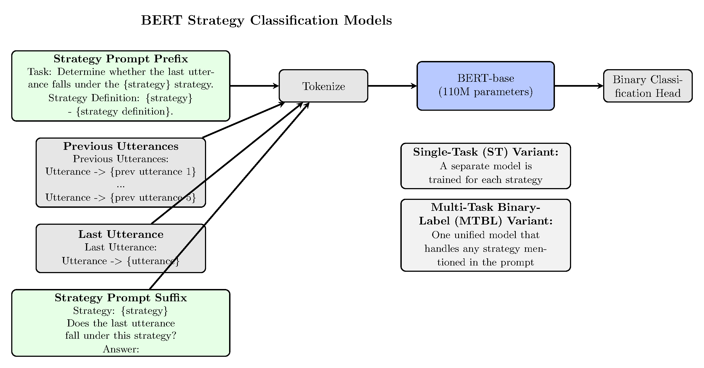
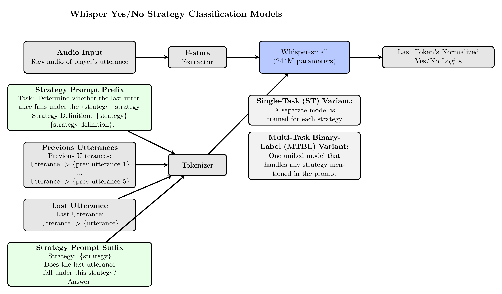
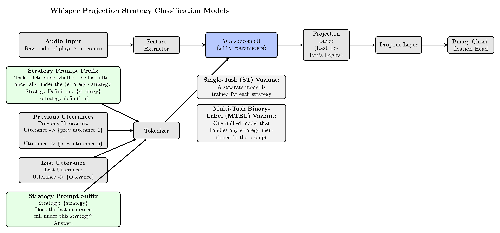
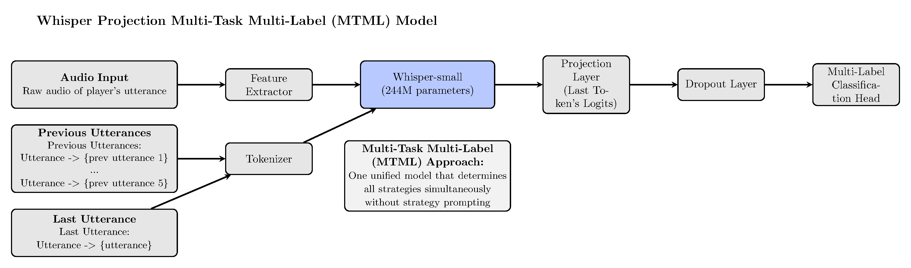
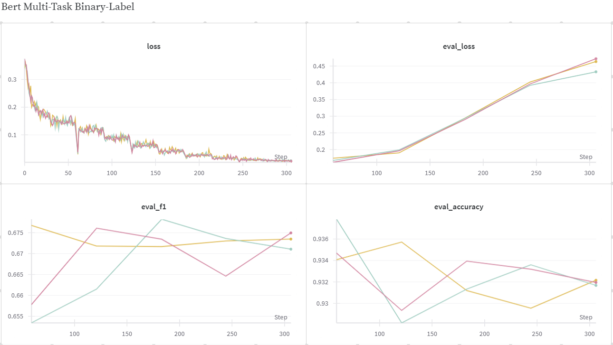
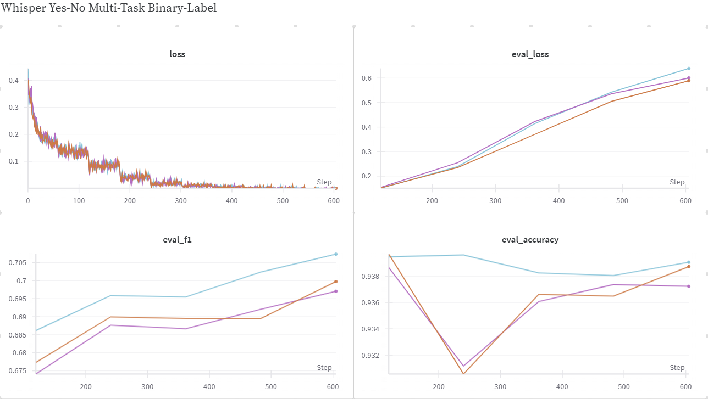
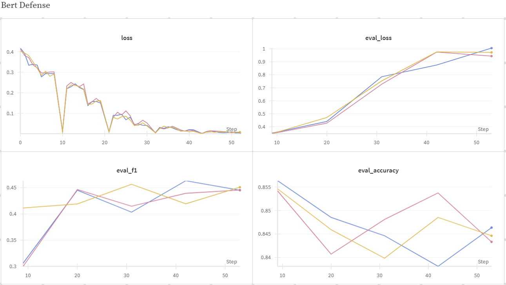
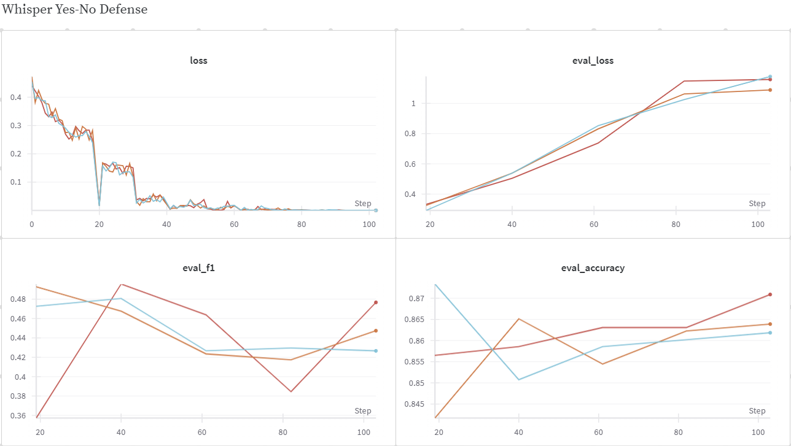

# Exploring the Audio Modality in Persuasion Modeling for Social Deduction Games

*Based on our research project building upon "Werewolf Among Us: A Multimodal Dataset for Modeling Persuasion Behaviors in Social Deduction Games"*

*Tags: #MachineLearning #NLP #AudioProcessing #PersuasionModeling #SocialDeductionGames #AI #DeepLearning #BERT #Whisper #Multimodal*

## Introduction

When we play social deduction games like "Werewolf" or "Among Us," persuasion plays a crucial role in winning. Whether you're a werewolf trying to convince others of your innocence or a villager trying to identify the werewolves, how you communicate can determine the outcome. But what exactly makes someone persuasive in these contexts?

Previous research has shown that combining text analysis with visual cues can improve our ability to detect persuasion strategies. But what about the audio component? How much information is carried in **how** something is said, beyond just the words themselves?

In this post, we'll explore our recent work investigating whether audio features can enhance persuasion modeling in social deduction games.

## The Challenge

Persuasion modeling aims to detect various persuasion strategies like:
- **Identity Declaration:** "I'm a villager!"
- **Accusation:** "I think Alex is the werewolf!"
- **Interrogation:** "What role did you get?"
- **Call for Action:** "We should vote for Alex."
- **Defense:** "I couldn't be the werewolf because..."
- **Evidence:** "I saw Alex sneaking around during the night phase."

Previous work by Lai et al. demonstrated that incorporating visual signals could improve the detection of these strategies by about 0.8% in F1 score compared to text-only models. Our question was simple: how much of this improvement comes from the audio component of the video?

## Our Approach

We implemented two main families of models:

### 1. BERT-based Models (Text-Only)
These models analyze only the transcript of what was said:
- **BERT Single-Task:** A separate classifier for each strategy
- **BERT Multi-Task Binary-Label:** A single model that can detect any strategy based on a prompt
- **BERT Multi-Task Multi-Label:** A single model that detects all strategies simultaneously

### 2. Whisper-based Models (Text + Audio)
These models leverage both the transcript and the audio features:
- **Whisper Yes-No Models:** Fine-tuned to generate "yes" or "no" to indicate if a strategy is present
- **Whisper Projection Models:** Extended with classification layers

All models were trained on the Werewolf Among Us dataset, which contains recordings of people playing social deduction games, with annotations for different persuasion strategies.

## Model Architectures

Let's look at the key model architectures we implemented:

### BERT Multi-Task Binary-Label



This architecture uses BERT as the backbone and takes as input:
1. A prompt specifying the strategy definition
2. Previous utterances for context
3. The target utterance to classify

The model outputs a binary prediction indicating whether the target utterance exhibits the specified strategy.

For implementation details, we used the Hugging Face `FlaxBertForSequenceClassification` model with binary classification output. The model initialization and training workflow can be found in `bert/multi_task_binary_label/main.py`. Our approach used a custom `TrainState` class to manage the model parameters and optimization logic.

### Whisper Yes-No Model



This model uses Whisper's audio processing capabilities. It takes:
1. Audio features from the conversation
2. Text of the previous utterances and target utterance
3. A prompt about the strategy

Instead of adding a classification head, we fine-tune Whisper to generate "yes" or "no" as an answer.

The implementation leverages the `FlaxWhisperForConditionalGeneration` model from Hugging Face, along with the Whisper tokenizer and feature extractor. The model setup and training process are defined in `whisper/single_task/main_yes_no.py`. We developed a custom `AudioCollator` class to efficiently process audio features and handle the unique requirements of our audio-based task.

### Whisper Projection Model



The Whisper Projection model takes a different approach to leveraging Whisper's capabilities for classification tasks. Rather than fine-tuning the model to generate yes/no responses, we:

1. Extract features from the Whisper encoder's last hidden state
2. Apply a projection layer to transform these features into a fixed-dimensional representation
3. Pass this representation through a dropout layer for regularization
4. Classify using a task-specific output layer

This approach aims to leverage Whisper's pre-trained audio understanding while adapting it more directly for classification tasks. The implementation is defined in `models/flax_whisper_for_sequence_classification.py`, which extends the standard Whisper model with these additional layers.

For the Multi-Task Multi-Label variant, we used a similar architecture but with a multi-label classification head that simultaneously predicts all six persuasion strategies. This version is particularly interesting as it doesn't rely on strategy-specific prompting, instead learning to identify all strategies from the same input representation.



Despite its elegant design, the Projection approach performed significantly worse than the Yes-No approach in our experiments. This suggests that adapting generative models for classification through architectural modifications is more challenging than leveraging their existing generative capabilities.

## Implementation Details

Our implementation used the JAX/Flax framework for efficient training on TPUs. We built upon:
- The original Werewolf Among Us repository
- Hugging Face Transformers Flax examples

For model training and evaluation, we used Weights & Biases (wandb) to track metrics like training loss, evaluation loss, F1 score, and accuracy.

The code structure was organized into:
```
├── bert/                    # BERT-based models
│   ├── single_task/
│   ├── multi_task_binary_label/
│   └── multi_task_multi_label/
├── whisper/                 # Whisper-based models
│   ├── single_task/
│   ├── multi_task_binary_label/
│   └── multi_task_multi_label/
├── models/                  # Model definitions
└── exp.sh                   # Training workflow
```

Our data loading pipeline, defined in `bert/load_data.py` and `whisper/load_data.py`, handled the preprocessing of text and audio data respectively. For the Whisper models, we implemented additional audio processing utilities to convert raw audio into the spectrograms required by the model.

The training workflow was managed by our `exp.sh` script, which coordinated the training of all model variants with different random seeds for robust evaluation. This script ensured consistent experimental conditions across all models and handled the creation of performance tables for final evaluation.

## Results

Our experiments yielded some interesting findings:

| Method | ID | ACC | INT | CA | DEF | EVI | Avg |
|--------|----|----|-----|----|----|-----|-----|
| BERT ST | 80.9±1.0 | 64.7±1.3 | 90.0±0.7 | 75.3±1.3 | 41.9±1.7 | 58.5±1.3 | 68.5±0.5 |
| BERT MTBL | 83.2±0.4 | **67.7±1.3** | **90.5±0.1** | 76.5±1.3 | 42.3±3.5 | **60.1±1.1** | 70.4±0.4 |
| BERT MTML | **83.5±0.4** | 67.7±0.7 | 90.4±0.2 | 74.9±0.1 | 44.1±0.4 | 57.3±0.5 | 69.7±0.1 |
| Whisper YN ST | 82.8±1.5 | 64.1±1.5 | 89.8±0.6 | **77.2±0.6** | 47.2±0.5 | 57.7±1.0 | 69.8±0.1 |
| Whisper YN MTBL | 83.4±0.3 | 66.3±0.3 | 90.2±0.2 | 77.1±1.2 | **48.6±1.6** | 58.5±0.5 | **70.9±0.3** |
| Whisper Proj ST | 38.4±2.8 | 33.1±1.0 | 51.9±2.0 | 33.8±6.8 | 21.1±2.8 | 25.2±2.5 | 33.9±1.8 |
| Whisper Proj MTBL | 0.0±0.0 | 0.0±0.0 | 0.0±0.0 | 0.0±0.0 | 0.0±0.0 | 0.0±0.0 | 0.0±0.0 |
| Whisper Proj MTML | 34.0±1.2 | 29.2±1.5 | 51.0±1.5 | 28.3±2.1 | 24.2±1.3 | 21.9±2.0 | 31.5±0.4 |

*F1 scores (%) for each persuasion strategy and average across all strategies. ID: Identity Declaration, ACC: Accusation, INT: Interrogation, CA: Call for Action, DEF: Defense, EVI: Evidence*

The Whisper Yes-No Multi-Task Binary-Label model achieved the best performance with a 70.9% average F1 score, outperforming the best BERT model by 0.5%. This suggests that audio features do indeed provide valuable signals for persuasion detection.

Particularly notable was the improvement for the "Defense" strategy, where including audio features resulted in a 6.3% gain in F1 score compared to the best text-only model (48.6% vs. 44.1%).

The multi-task approaches generally outperformed single-task models, indicating that joint learning across strategies is beneficial.

The Whisper Projection models, despite their more direct adaptation for classification tasks, performed surprisingly poorly. The MTBL variant failed to learn anything useful (all zero F1 scores), while the ST and MTML variants showed some learning but still fell far behind the BERT and Whisper Yes-No models. This result highlights the challenges in adapting generative pre-trained models for classification tasks and suggests that the Yes-No approach aligns better with Whisper's pre-training objectives.

## Training Dynamics

The convergence graphs revealed interesting patterns:





Looking at the convergence graphs for "Defense" strategy specifically:





Observations:
- Whisper Yes-No models generally reached optimal performance more quickly than BERT models
- For difficult strategies like "Defense," Whisper-based models showed more stable learning curves
- The Whisper Projection models exhibited unstable training, which aligned with their poor performance

These convergence graphs suggest that incorporating audio features may help models converge faster and more stably for certain persuasion strategies.

## Key Takeaways

1. **Audio improves persuasion detection:** Adding audio features to text-based models enhanced performance by 0.5% in F1 score.

2. **Much of video's value comes from audio:** The improvement we observed (0.5%) represents a significant portion of the 0.8% gain previously reported when using full video features.

3. **Audio particularly helps with "Defense" detection:** The emotional content in voice appears especially valuable when evaluating defensive statements.

4. **Model architecture matters:** The way we incorporate audio features significantly impacts performance. Our Yes-No approach worked well, while the Projection approach struggled.

## Future Directions

This research opens several promising avenues for future work:

- **Improved audio representation learning:** Developing specialized audio encoders for persuasion tasks
- **Fine-grained audio feature analysis:** Understanding which specific audio features (pitch, energy, speech rate) contribute most to persuasion detection
- **Cross-domain applications:** Testing these models on other domains like political debates, sales negotiations, or therapeutic conversations

## Why This Matters

Understanding persuasion strategies has applications beyond gaming:

- Enhancing conversational AI to recognize and respond appropriately to persuasion attempts
- Improving communication training for negotiations, sales, or therapy
- Developing more nuanced understanding of human social interactions

By incorporating audio features, we can build more comprehensive models of persuasion that capture not just what is said, but how it's said.

## Code and Resources

Our implementation is available on GitHub at [github.com/alonbebchuk/PersuationGames](https://github.com/alonbebchuk/PersuationGames).

This work builds upon the "Werewolf Among Us" paper by Lai et al., which introduced the dataset and initial persuasion modeling approaches:

> Lai, B., Liu, Z., Tong, M., Zhou, Y., Yu, Z., Wang, W.Y. (2022). **Werewolf Among Us: A Multimodal Dataset for Modeling Persuasion Behaviors in Social Deduction Games**. [arXiv:2212.08279](https://arxiv.org/abs/2212.08279)

Our code is forked from the original repository by the SALT-NLP team at the University of Washington:
- Paper: [arxiv.org/abs/2212.08279](https://arxiv.org/abs/2212.08279)
- Original GitHub Repository: [github.com/SALT-NLP/PersuationGames](https://github.com/SALT-NLP/PersuationGames)
- Dataset: [huggingface.co/datasets/bolinlai/Werewolf-Among-Us](https://huggingface.co/datasets/bolinlai/Werewolf-Among-Us)

We also built upon the Hugging Face Transformers library for implementing our models.

---

*This post is based on our research project exploring the audio modality in persuasion modeling. For the full technical details, please refer to our complete project.*

---

*About the authors: Alon Bebchuk (pursuing MsC, Tel Aviv University) and Ohad Rubin (pursuing Doctorate, Tel Aviv University) final project for course Advanced Topics in Audio Processing using Deep Learning, Tel Aviv University, Lecturer Dr. Tal Rosenwein.* 